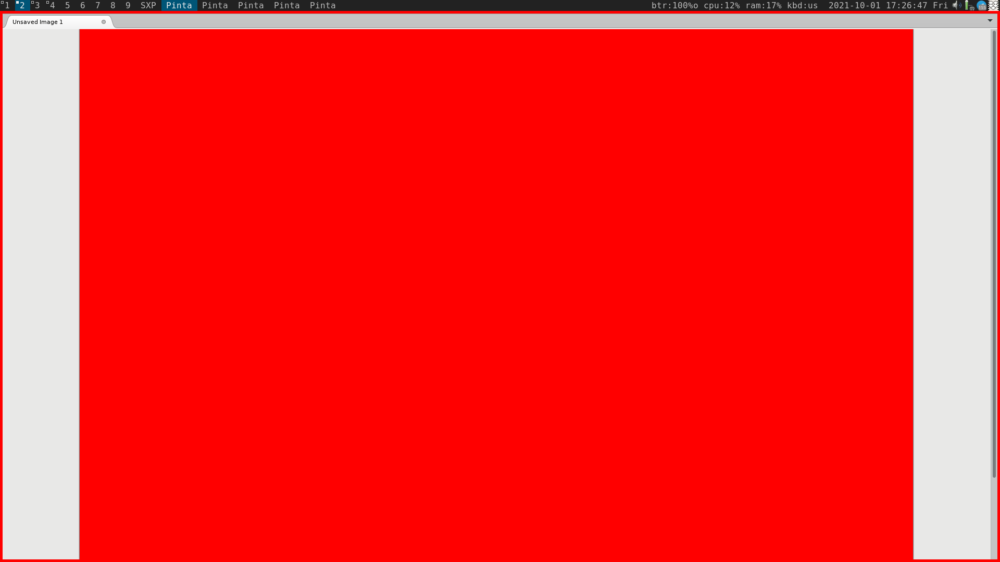
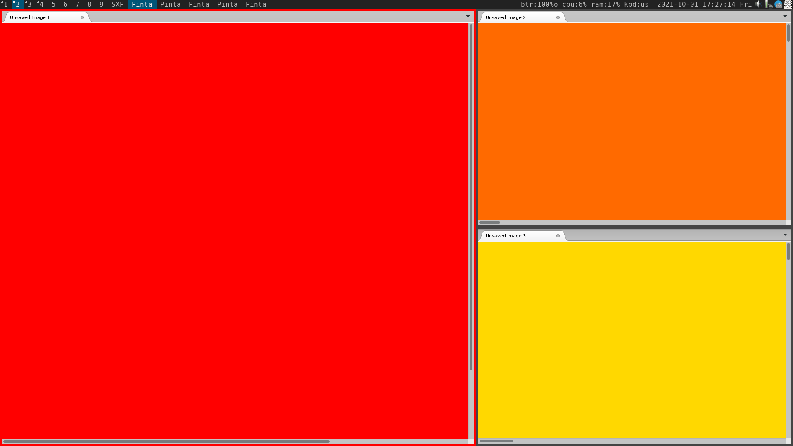
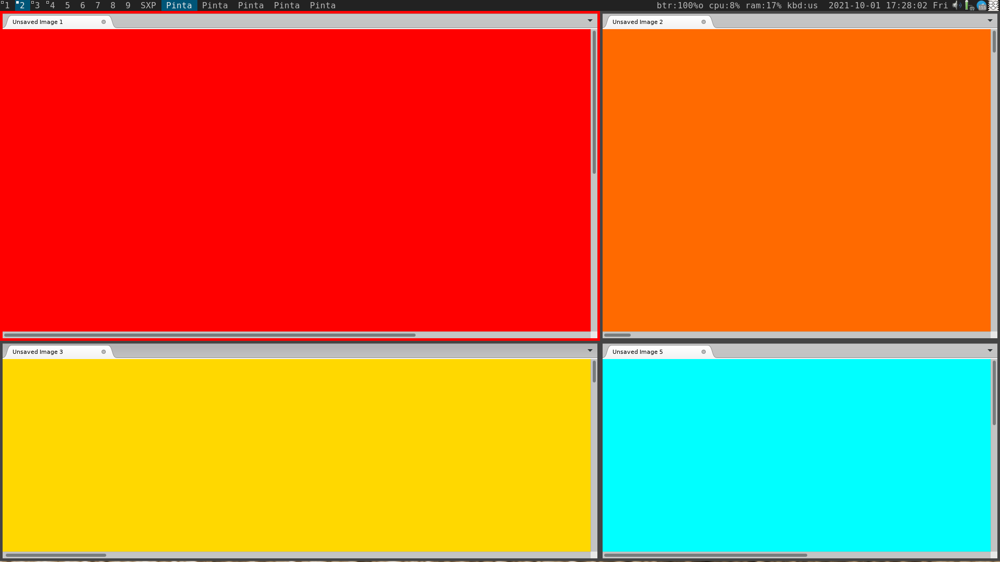
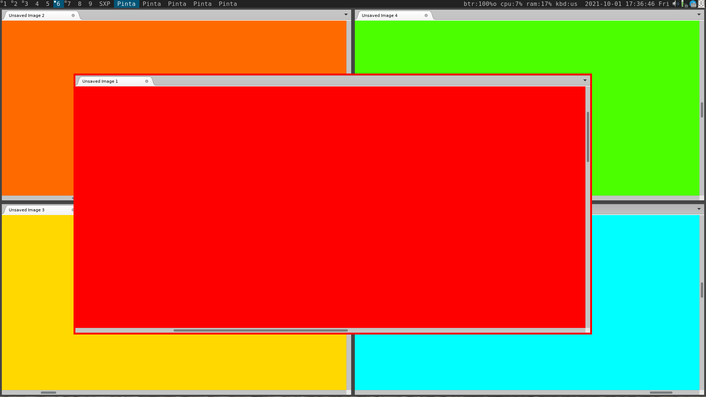
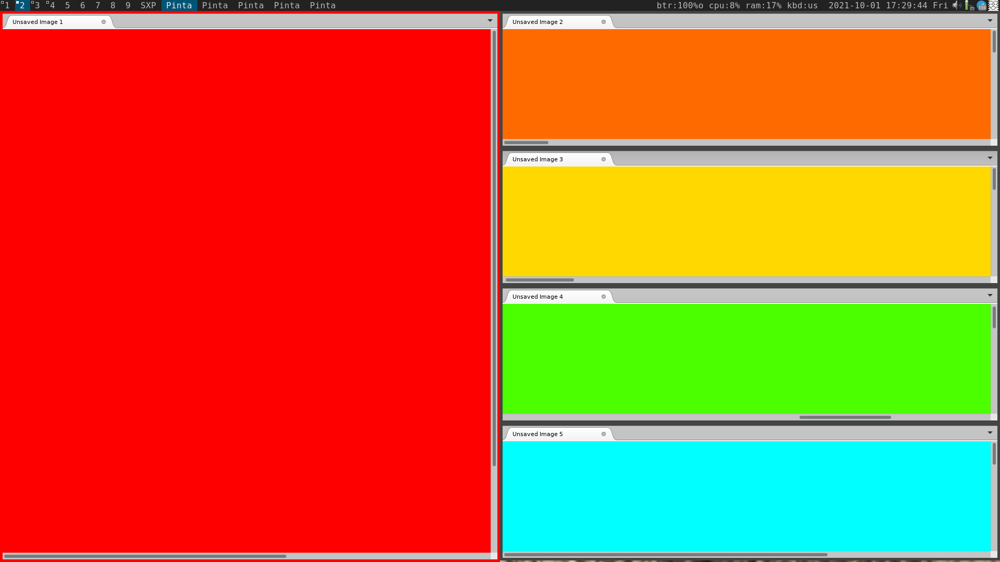
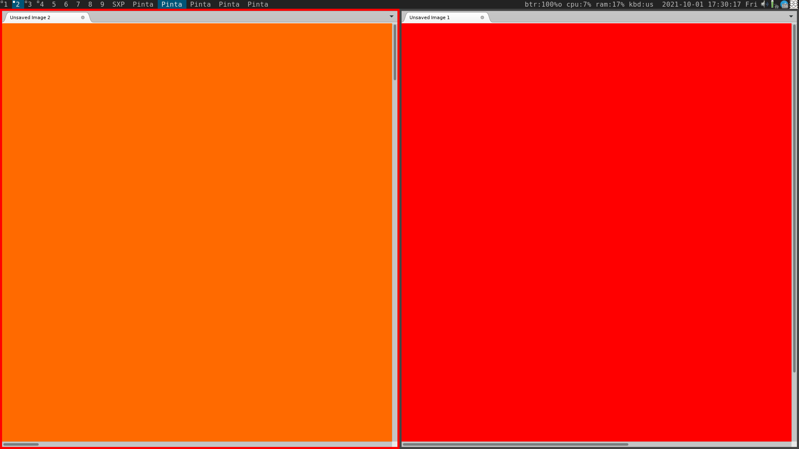
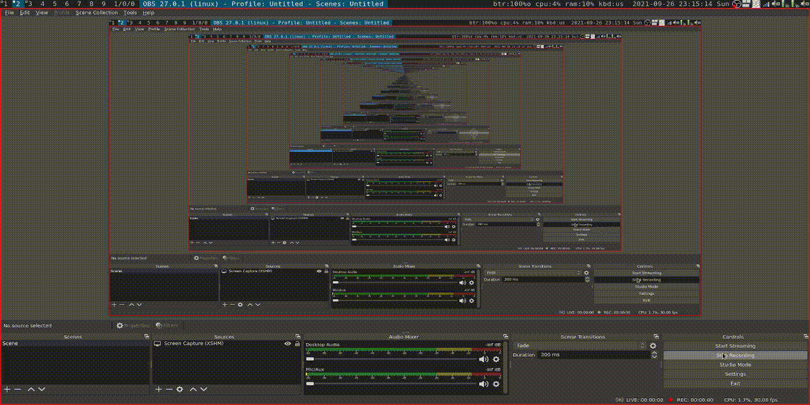

# Introduction

This extension allows you to create a custom layout using simplified s-expressions.
It allows the user to enter the layout description using dmenu and creates the corresponding dynamic layout.

I have to admit that I almost never needed this functionality. *Tiling* and *monocle* layouts were always enough for me.
But I kind of wanted this functionality to be available nonetheless, so I decided to try implementing it for fun.
Hopefully someone may find it useful.

The syntax is basically s-expressions with outermost parentheses removed for convenience.

I tried to keep the code simple in the spirit of DWM, but in the end I decided to keep it as a separate file just so
it is easier to modify, test and distribute.

# Current state

It works. More tesing is needed and I still have a few items in my TODO. In particular, it does not take window margin
setting into account.

TODO
- [x] Add an empty frame placeholder.
- [x] Support for windows margin/borders.
- [x] Custom window margins.
- [ ] Void container to hide the leftover windows.
- [ ] Make it possible to apply attributes to multi-client patterns, like (nth) and (...)
- [ ] Floating configuration for the containers (h, v, m). Currently the floating mode only works for **c** element.
- [ ] Provide a reasonable default for sxp layout.
- [ ] Perhaps, some syntax improvements, e.g. replace `(nth ...)` with something quicker.

# Examples

See screencasts at the end of the README for some live examples.
Here are some text examples.

`h c (v ...)`  
Simple tile layout.


`m ...`  
Monocle.


```
h (c w: 1.5) (v c (m ...))
|  |          | |  |  |
|  |          | |  |  \_ all the leftover windows will be put here
|  |          | |  \_ monocle node (all windows under it will occupy the same frame)
|  |          | \_ single client 
|  |          \_ vertical layout node
|  \_ a place for one client with weight of 1.5 relative to its neighbours
\_ horizontal layout node
```  
Tiling layout with weighted main viewport (1.5 times the neighbours).
The stack area is limited with two clients. The leftover windows will occupy the right bottom frame.


```
v (h w: 1.5 (c w: 1.5) c) (h (c w: 1.5) (m ...))
|  |         |         |   |  |          |
|  |         |         |   |  |          \_ right bottom viewport, monocle layout which contains the rest of the windows
|  |         |         |   |  \_ bottom left viewport with weight of 1.5
|  |         |         |   \_ bottom horizontal layout, default weight
|  |         |         \_ a single client with default weight of 1
|  |         \_ a upper left viewport for a single client with 1.5 weight
|  \_ horizontal layout with weight of 1.5
\_ vertical layout
```
My personal favorit. Arranges the windows in a kind of a grid 2x2 where the left column and the upper row are 1.5 times
wider/higher.


```
h (c f: 200 200 1400 700) (v c c) (v c (m ...))
|  |                       |       |
|  |                       |       \_ another vertical container with two slots.
|  |                       \_ vertical container with two slots
|  \_ a viewport with a custom geometry, it will not take space from the parent horizontal layout
\_ horizontal layout container
```  
A layout with the main window in the center, surrounded by four other windows.


`h c (v (max 3) (m ...))`  
One master + four slots in the stack area. Every other window will be stacked in the last frame.


`h (nth 1) (nth 0)`  
Display first two clients from the list, the first after the second.
WARNING: In this setup the other clients will be left untouched from the 


# Syntax
## Containers
`(h ...)` or `(horizontal ...)`  
Horizontal spread.
The nodes are distributed horizontally, according to the weight of each one.

`(hr ...)` or `(h-reversed ...)`  
Reversed horizontal layout (clients are filled from right to left).

`(v ...)` or `(vertical ...)`  
Vertical spread.
The nodes are distributed vertically, according to the weight of each one.

`(vr ...)` or `(v-reversed)`  
Reversed vertical layout. Clients are filled from bottom to top.

`(m ...)` or `(monocle ...)`  
"Monocle". All clients share the same geometry.

## Elements
`c` or `client`  
A slot for a single client. 

`e` or `empty`  
An empty viewport. A visual space will be allocated, but no client will be assigned to it.

`(nth <number>)`  
Pick a client from the client stack by the number.
`(nth 0)` represents the first client, `(nth 1)` - the second etc.

`(max <number>)`  
Provides a space for at most `<number>` clients in a container.

`...` or `rest`  
The rest of the clients from the client stack.

## Node parameters
`w: <number>` or `weight: <number>`  
Weight. Affects the amount of space the node takes relative to its neighbours.

`f: <x> <y> <width> <height>` or `float: <x> <y> <width> <height>`  
Custom geometry, a.k.a. floating viewport. Can be a part of any container. Does not take the container's space.

# Installation and configuration

The patch is coming soon. For now the installation is manual, but should not be too difficult anyway.

## 1. Copy the *s_layout.c* file into the DWM folder.
## 2. Include it from *dwm.c* before including *config.h*
```c
...
static Drw *drw;
static Monitor *mons, *selmon;
static Window root, wmcheckwin;
static int restart = 0;

/*=== s_layout ===*/
#include "s_layout.c"

/* configuration, allows nested code to access above variables */
#include "config.h"
...
```

## 3. Add the layout to the layout list in your `config.h`
```c
static const Layout layouts[] = {
   /* symbol     arrange function */
   { "[]=",      tile },    /* first entry is default */
   { "[M]",      monocle },
   { "><>",      NULL },    /* no layout function means floating behavior */
   { "HHH",      grid },
   { "TTT",      bstack },

   { "SXP",      s_layout }, /* sxp_layout */
};
```

## 4. Add hotkeys for setlayout and `set_s_layout` functions
`set_s_layout` will open dmenu so you can type the new layout in (don't forget to use Shift+Enter to override dmenu's hints), whereas setlayout will just switch you to the existing sxp layout.
```c
   ...
   { MODKEY,                       XK_t,      setlayout,      {.v = &layouts[0]} },
   { MODKEY,                       XK_m,      setlayout,      {.v = &layouts[1]} },
   { MODKEY,                       XK_f,      setlayout,      {.v = &layouts[2]} },
   { MODKEY,                       XK_g,      setlayout,      {.v = &layouts[3]} },
   { MODKEY,                       XK_u,      setlayout,      {.v = &layouts[4]} },

   { MODKEY,                       XK_s,      setlayout,      {.v = &layouts[5]}},
   { MODKEY|ShiftMask,             XK_s,      set_s_layout,   {.v = &layouts[5]}},
   ...
```

# Screencast 1

Playing around with simple layouts.


# Screencast 2

Creating a floating viewport.


